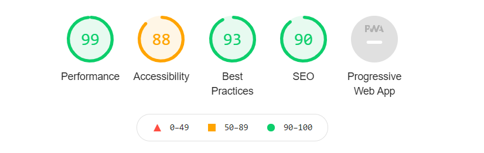

Creekside Electrical Services.

    This is a mock up website of a local electrical company.
    Starting with background images through out the site I used flexbox to configure most of the elements on this page.
    The site starts with a hamburger menu on the top right which opens a menu of clickable links that are refrenced inside the website. I used pseudo classes while doing this.
    Scrolling further I used font awesome images to help emphasize electrical skills that that contractor wanted in the site.
    Next I created some cards with images that also display and convay what the contractor specializes in.
    after the cards I created a form that allows customers to make or schedule an appointment or contact the contractor for any specific questions. I used JavaScript to validate the email input.
    Finally in the footer has conact address with another set of font awesome icons that will be able to reach the contractor on other sites including linkdin and Facebook.
    I Performed a Web Accessibility Compliance review using lighthouse inside of chrome developer tools.

